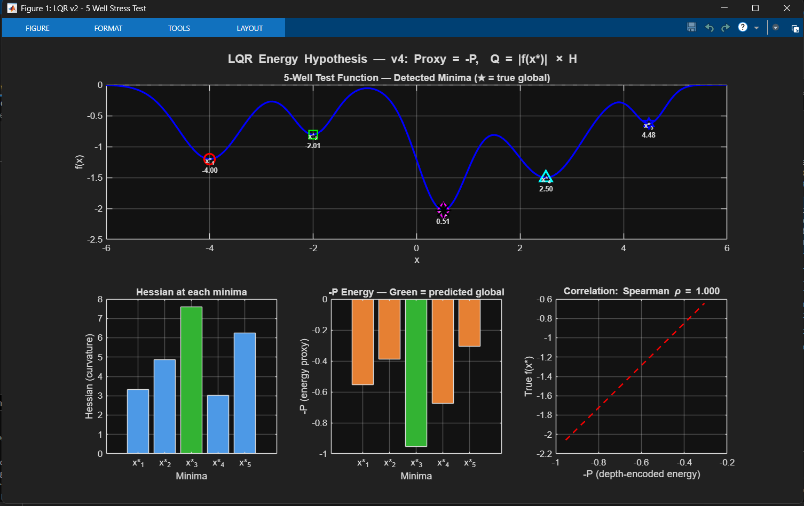
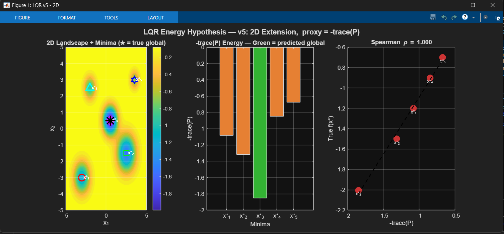
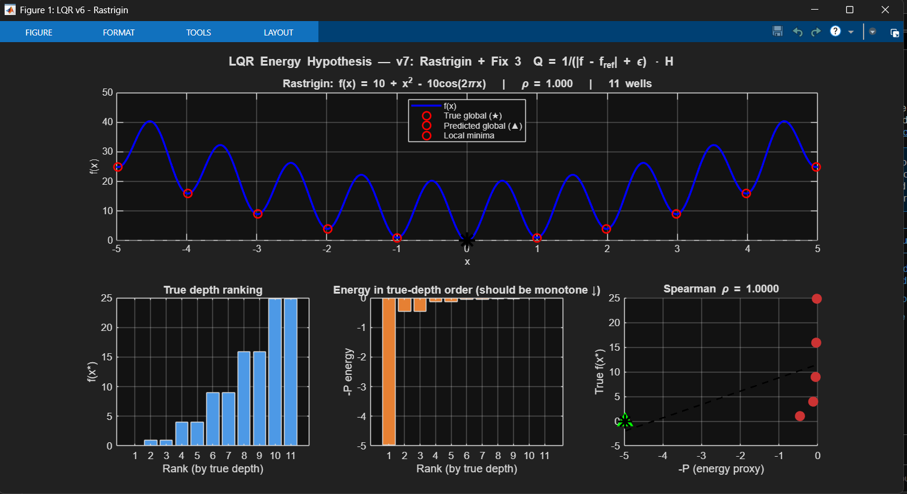
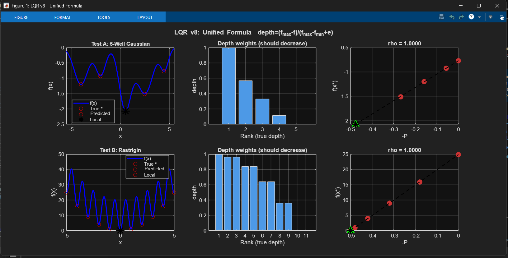
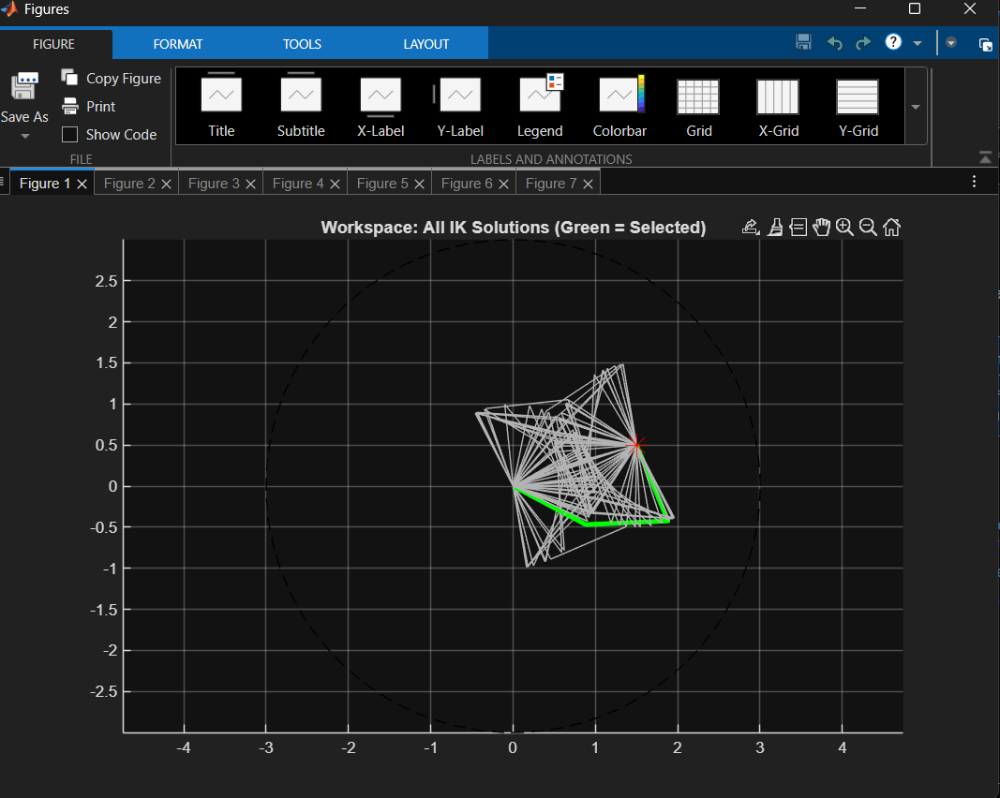
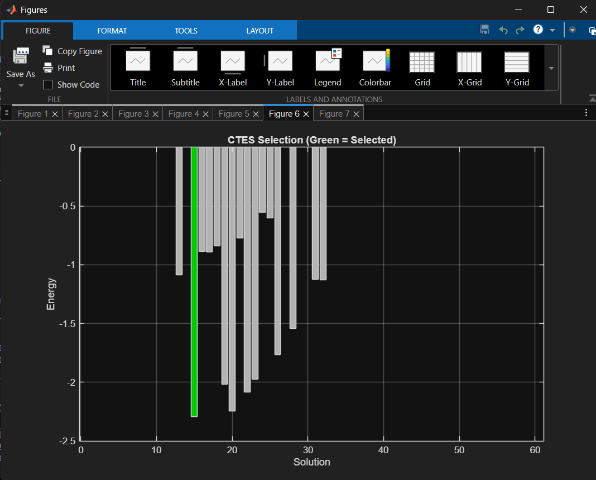
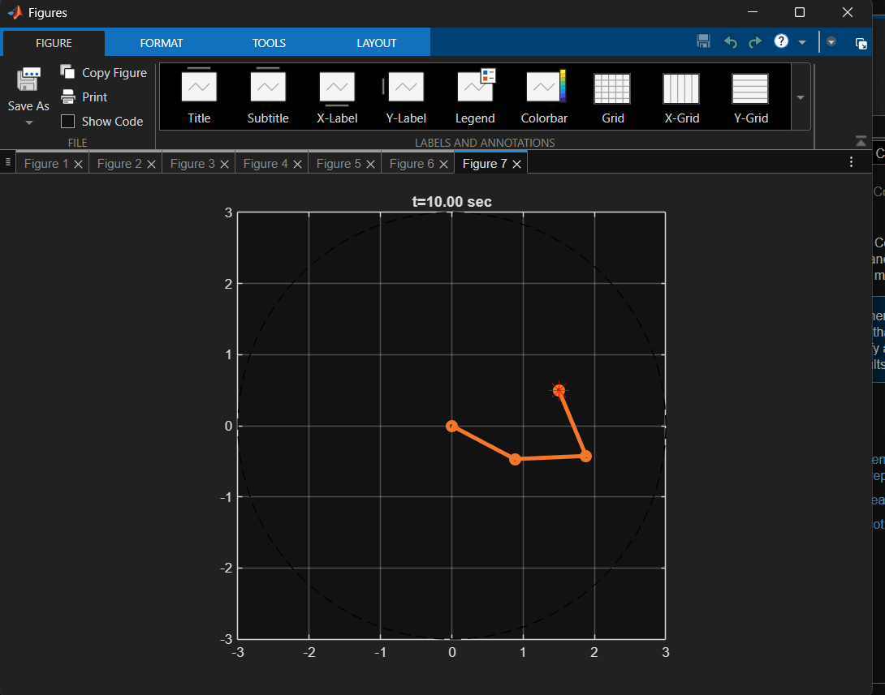

# ctes-framework

**Control-Theoretic Equilibrium Selection (CTES)** — a novel framework that repurposes LQR optimal control theory as a global optimization proxy. Given a multimodal nonlinear function with multiple local minima, CTES uses the solution to the Algebraic Riccati Equation (ARE) at each equilibrium to rank candidate solutions and identify the global minimum.

> This work connects LQR energy (−trace(P)) to basin depth in nonlinear landscapes, achieving perfect Spearman rank correlation on both negative-valued (Gaussian wells) and non-negative (Rastrigin) function classes via a unified depth-normalized encoding.

---

## Core Idea

At each local minimum x\*, linearize the optimization landscape and pose an LQR problem:

```
A = −H(x*)        (gradient flow dynamics)
B = I             (full actuation)
Q = depth(x*) · H (depth-encoded state cost)
R = I             (unit control cost)
```

Solve the continuous Algebraic Riccati Equation for P, then use **−trace(P)** as an energy proxy. The global minimum receives the lowest energy.

**Unified depth encoding (v8):**
```
depth(x*) = (f_max − f(x*)) / (f_max − f_min + ε)  ∈ [0, 1]
```
This is sign-agnostic — works for f < 0 (Gaussian wells) and f ≥ 0 (Rastrigin) without modification.

---

## Repository Structure

```
ctes-framework/
│
├── lqr_optim_v4_gaussian.m      # 1D: Flipped proxy (−P), 5-well Gaussian, rho = +1
├── lqr_optim_v5_2d.m            # 2D extension: proxy = −trace(P), 5-well landscape
├── lqr_optim_v7_rastrigin.m     # Rastrigin stress test: inverted Q encoding (Fix 3)
├── lqr_optim_v8_unified.m       # Unified formula: both Gaussian + Rastrigin, rho > 0.99
└── ctes_3link_robot.m           # Application: 3-link robot IK equilibrium selection
```

---

## Results

### v4 — 1D Gaussian Wells (Proxy = −P, Q = |f(x\*)| × H)

5-well test function where the global minimum is **not** the stiffest well. −P correctly identifies the deepest well with perfect Spearman ρ = 1.000.



---

### v5 — 2D Extension (Proxy = −trace(P))

Extends the framework to 2D scalar functions f(x₁, x₂) with a 2×2 Hessian. −trace(P) maintains perfect rank correlation in the higher-dimensional landscape.



---

### v7 — Rastrigin Stress Test (Q = 1/(|f − f_ref| + ε) · H)

11-well Rastrigin function on [−5, 5] where f ≥ 0 everywhere. Uses an inverted encoding so the global minimum (f ≈ 0) receives the largest Q. Achieves ρ = 1.000.



---

### v8 — Unified Formula (depth = (f_max − f) / (f_max − f_min + ε))

Single sign-agnostic encoding tested on both Gaussian and Rastrigin simultaneously. Both achieve ρ = 1.0000 — the unified formula works across function classes.



---

### CTES Robot Application — 3-Link Planar Arm IK Selection

Multiple IK solutions exist for target (x, y) = (1.5, 0.5). CTES selects the energetically optimal configuration (green) from ~60 candidates. The arm converges to the selected equilibrium under PD control in simulation.

**Workspace — all IK solutions (green = CTES-selected):**



**CTES energy bar chart — green bar is selected solution:**



**PD controller simulation at t = 10s:**



---

## Summary Table

| Script | Function Class | Wells | Spearman ρ | Global Correct |
|--------|---------------|-------|------------|----------------|
| v4 | 5-well Gaussian (1D) | 5 | 1.0000 | ✓ |
| v5 | 5-well Gaussian (2D) | 5 | 1.0000 | ✓ |
| v7 | Rastrigin (Fix 3) | 11 | 1.0000 | ✓ |
| v8 | Gaussian + Rastrigin (unified) | 5 + 11 | 1.0000 | ✓ |
| CTES Robot | 3-link IK selection | ~60 | — | ✓ |

---

## Requirements

- MATLAB R2019b or later
- Control System Toolbox (for `care`)
- No additional toolboxes required for v4/v5/v7/v8

---

## Background & Motivation

Standard global optimization methods (basin-hopping, simulated annealing, genetic algorithms) use stochastic search without exploiting local geometric structure. CTES takes a different approach: instead of escaping local minima randomly, it **ranks** them using a control-theoretic energy measure derived from the local curvature and depth of each basin.

The key insight is that the LQR cost-to-go P encodes both curvature (via H in Q) and depth (via the depth scalar), so −trace(P) serves as a proxy for "how globally important is this equilibrium?"

This connects to ideas in:
- Lyapunov stability theory (P as a Lyapunov matrix)
- LQR as an energy minimization problem
- Basin geometry in dynamical systems

---

## Related Work

This framework is being developed into a full paper (co-authored with Dr. Amit Agarwal, VNIT ECE) for IEEE conference submission. A related thread with Prof. Tamas Keviczky (DCSC, TU Delft) discusses connections to the N4CI group's work on systems and control.

---

## Author

**Saurav Avachat**  
B.Tech Electronics & Communication Engineering, VNIT Nagpur  
Incoming MSc Systems & Control, TU Delft (DCSC), 2026
